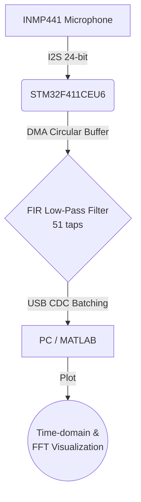

# Real-Time FIR Audio Filtering on STM32F411 Using I2S DMA and USB CDC

This repository contains a complete Digital Signal Processing (DSP) project implementing a **Real-Time Low-Pass FIR (Finite Impulse Response) Filter** on the STM32F411CEU6 microcontroller. The system captures audio from an I2S microphone, filters it using a 51-tap FIR algorithm, and transmits the data to a PC via USB CDC for real-time visualization in MATLAB.

## 📊 System Architecture

The following block diagram illustrates the data flow of the system from the acoustic input to the PC visualization:

*(Alternatively, see the [System Block Diagram](docs/images/system_block_diagram.png))*

## ⚙️ Filter Specifications

| Parameter | Value |
| --- | --- |
| **MCU** | STM32F411CEU6 (Black Pill) |
| **Input device** | INMP441 I2S microphone |
| **Sampling rate** | ~48 kHz |
| **Filter type** | FIR Low-Pass |
| **Cutoff frequency** | 20 kHz |
| **Number of taps** | 51 |
| **Window** | Hamming |
| **Data transfer** | USB CDC (Virtual COM) |
| **Visualization** | MATLAB (Time-domain & FFT) |

### Why a 20 kHz Cutoff?
The 20 kHz cutoff was selected because it is close to the upper limit of the audible audio band. With a sampling rate of approximately 48 kHz, the Nyquist frequency is around 24 kHz, so the filter is designed to preserve most audible components while suppressing high-frequency noise near the Nyquist region.

## 🔌 Hardware Wiring

Connect the INMP441 I2S Microphone to the STM32F411CEU6 as follows:

| INMP441 Pin | STM32F411CEU6 Pin | Description |
| --- | --- | --- |
| **VCC** | 3.3V | Power Supply |
| **GND** | GND | Ground |
| **SCK** | PB10 | I2S2_CK (Serial Clock) |
| **WS** | PB12 | I2S2_WS (Word Select / L-R Clock) |
| **SD** | PB15 | I2S2_SD (Serial Data) |
| **L/R** | GND or 3.3V | Left/Right Channel Selection |

*(See [Hardware Setup](docs/images/hardware_setup.jpg))*

## 🚀 How to Run

1. **Hardware Setup:** Connect the INMP441 to the STM32 using the wiring table above.
2. **Flash Firmware:** Open the `STM32F411CEU6/` folder in STM32CubeIDE, build the project, and flash it to the microcontroller using an ST-Link.
3. **Connect to PC:** Connect a USB cable from the STM32's USB port (Type-C on Black Pill) to your PC. It will be recognized as a USB Virtual COM Port.
4. **Open MATLAB:** Navigate to the `MATLAB/` directory in this repository.
5. **Configure COM Port:** Open `mode_test.m` and `mode_mic.m` and change the COM port string (e.g., `'COM3'`) to match your assigned port.
6. **Verify Algorithm (Test Mode):** Run `mode_test.m` first. This mode generates an internal test signal without relying on the microphone, ensuring the FIR algorithm and USB communication work correctly.
7. **Run Real-Time Microphone (Mic Mode):** Once verified, run `mode_mic.m` to see real-time audio capturing and filtering.

## 📈 Results and Discussion

In test mode, the generated signal contains a low-frequency component and a high-frequency component. After FIR filtering, the high-frequency component near the Nyquist region is attenuated, while the lower-frequency component is perfectly preserved. 

In microphone mode, the filter effectively reduces high-frequency environmental noise, resulting in a significantly smoother waveform in the time domain.

- **Time Domain Analysis:** [View Image](docs/images/matlab_time_domain.png)
- **FFT Spectrum (Before & After):** [View Image](docs/images/matlab_fft_before_after.png)
- **Frequency Response:** [View Image](docs/images/fir_frequency_response.png)

*(Note: Please upload the actual screenshots to `docs/images/` to see the results here).*

## ⚠️ Limitations

- The 20 kHz cutoff is very close to the Nyquist frequency at a 48 kHz sampling rate, which results in a relatively narrow transition band.
- A 51-tap FIR filter provides moderate attenuation but does not yield a completely sharp cutoff.
- USB CDC is currently utilized for data batching and visualization purposes, not for high-fidelity audio playback.
- The scope of this project is heavily focused on real-time signal analysis and visualization rather than audio output to an I2S DAC or speaker.

## 🔮 Future Work

- Compare different FIR lengths (e.g., 31, 51, 101 taps) to analyze the trade-off between attenuation sharpness and computational latency.
- Add Band-Pass and High-Pass filter modes.
- Implement real-time audio playback by routing the filtered signal to an I2S DAC.
- Measure and document precise CPU usage and processing latency.
- Implement a Fixed-Point FIR algorithm to reduce computational overhead.
- Compare manual FIR Convolution with the optimized `CMSIS-DSP` FIR functions.

## 📄 License
This project is licensed under the MIT License - see the [LICENSE](LICENSE) file for details.
