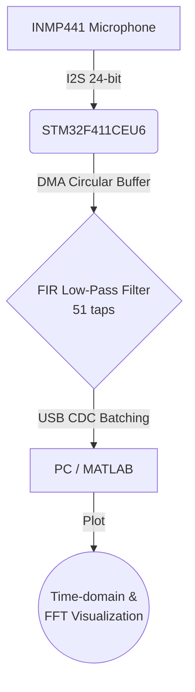

# Real-Time Low-Pass FIR Audio Filter on STM32

This project implements a real-time FIR low-pass audio filter on the STM32F411CEU6 microcontroller. Audio data is captured from an I2S microphone using DMA, processed with a 51-tap FIR filter, and sent to a PC through USB CDC. MATLAB scripts are provided to display the raw and filtered signals in both the time and frequency domains.

## 📊 System Architecture

The following block diagram illustrates the data flow of the system from the acoustic input to the PC visualization:

*(Alternatively, see the [System Block Diagram](docs/images/system_block_diagram.png))*

## 🌟 Key Features

- **DMA-Based Audio Sampling:** Captures audio data from an I2S microphone using continuous DMA buffers.
- **FIR Filter:** Implements a 51-tap Low-Pass FIR filter designed via the Window Method in MATLAB.
- **USB CDC Data Transfer:** Groups processed data into buffers before transmission to reduce USB transmission overhead.
- **Dual Operating Modes:**
  - `MODE_MIC`: Processes real acoustic data from the I2S microphone.
  - `MODE_TEST`: Generates an internal simulated waveform for algorithm verification.
- **MATLAB Integration:** MATLAB scripts to receive USB data, compute the Fast Fourier Transform (FFT), and visualize both raw and filtered signals.

## 📂 Repository Structure

- `STM32F411CEU6/`: The STM32CubeIDE project containing the C source code, HAL drivers, USB device library, and hardware configuration (`.ioc`).
  - `Core/Src/main.c`: Main application code, including FIR convolution, I2S/DMA setup, and USB CDC data handling.
- `MATLAB/`: MATLAB scripts for data visualization and filter design.
  - `firfft.m`: Calculates filter coefficients.
  - `mode_mic.m` / `mode_test.m`: Reads USB serial data from the STM32 and plots real-time waveforms and FFT spectrum.

## ⚙️ Filter Specifications

| Parameter | Value |
| --- | --- |
| **MCU** | STM32F411CEU6 (Black Pill) |
| **Input device** | INMP441 I2S microphone |
| **Sampling rate** | ~48 kHz |
| **Filter type** | FIR Low-Pass |
| **Cutoff frequency** | 20 kHz |
| **Number of taps** | 51 |
| **Window** | Hamming |
| **Data transfer** | USB CDC (Virtual COM) |
| **Visualization** | MATLAB (Time-domain & FFT) |

### Why a 20 kHz Cutoff?
The 20 kHz cutoff was selected because it is close to the upper limit of the audible audio band. With a sampling rate of approximately 48 kHz, the Nyquist frequency is around 24 kHz, so the filter is designed to preserve most audible components while suppressing high-frequency noise near the Nyquist region.

## 🔌 Hardware Wiring

Connect the INMP441 I2S Microphone to the STM32F411CEU6 as follows:

| INMP441 Pin | STM32F411CEU6 Pin | Description |
| --- | --- | --- |
| **VCC** | 3.3V | Power Supply |
| **GND** | GND | Ground |
| **SCK** | PB10 | I2S2_CK (Serial Clock) |
| **WS** | PB12 | I2S2_WS (Word Select / L-R Clock) |
| **SD** | PB15 | I2S2_SD (Serial Data) |
| **L/R** | GND or 3.3V | Left/Right Channel Selection |

*(See [Hardware Setup](docs/images/hardware_setup.jpg))*

## 🚀 How to Run

1. **Hardware Setup:** Connect the INMP441 to the STM32 using the wiring table above.
2. **Flash Firmware:** Open the `STM32F411CEU6/` folder in STM32CubeIDE, build the project, and flash it to the microcontroller using an ST-Link.
3. **Connect to PC:** Connect a USB cable from the STM32's USB port (Type-C on Black Pill) to your PC. It will be recognized as a USB Virtual COM Port.
4. **Open MATLAB:** Navigate to the `MATLAB/` directory in this repository.
5. **Configure COM Port:** Open `mode_test.m` and `mode_mic.m` and change the COM port string (e.g., `'COM3'`) to match your assigned port.
6. **Verify Algorithm (Test Mode):** Run `mode_test.m` first. This mode generates an internal test signal without relying on the microphone, ensuring the FIR algorithm and USB communication work correctly.
7. **Run Real-Time Microphone (Mic Mode):** Once verified, run `mode_mic.m` to see real-time audio capturing and filtering.

## 📈 Results and Discussion

**Test Mode (Algorithm Verification):**
Generating acoustic signals above 20 kHz in a real-world environment to test the microphone is practically challenging. To overcome this, a synthetic test signal containing both low-frequency and high-frequency (>20 kHz) components was generated and injected directly into the STM32 processing pipeline. As seen in the FFT spectrum before and after, the >20 kHz noise near the Nyquist region is successfully attenuated by the hardware FIR filter, proving the algorithmic correctness.

**Microphone Mode (Real-World Operation):**
When capturing actual audio from the I2S microphone, the filter effectively removes high-frequency environmental noise, resulting in a significantly smoother waveform in the time domain without distorting the audible frequencies.

- **Time Domain Analysis:** [View Image](docs/images/matlab_time_domain.png)
- **FFT Spectrum (Test Mode - Before & After):** [View Image](docs/images/matlab_fft_before_after.png)
- **Frequency Response:** [View Image](docs/images/fir_frequency_response.png)

## ⚠️ Limitations

- The 20 kHz cutoff is close to the Nyquist frequency at a 48 kHz sampling rate, which results in a relatively narrow transition band.
- A 51-tap FIR filter provides moderate attenuation but does not yield a completely sharp cutoff.
- USB CDC is currently utilized for data transmission and visualization purposes, not for high-fidelity audio playback.
- The scope of this project focuses on real-time signal analysis and visualization rather than audio output to an I2S DAC or speaker.

## 🔮 Future Work

- Compare different FIR lengths (e.g., 31, 51, 101 taps) to analyze the trade-off between attenuation sharpness and computational cost.
- Add Band-Pass and High-Pass filter modes.
- Implement real-time audio playback by routing the filtered signal to an I2S DAC.
- Measure and document precise CPU usage and processing latency.
- Implement a Fixed-Point FIR algorithm to reduce computational overhead.
- Compare manual FIR Convolution with the CMSIS-DSP FIR implementation.

## 📄 License
This project is licensed under the MIT License - see the [LICENSE](LICENSE) file for details.
